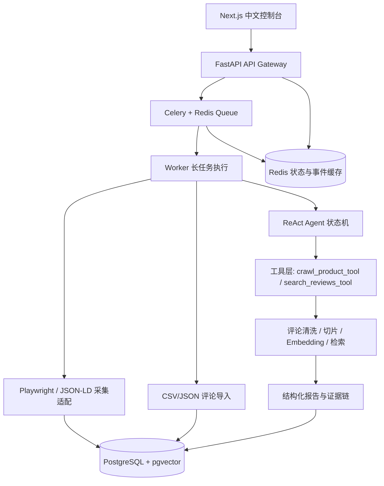

# MarketMind Agent

MarketMind Agent 是一个面向电商运营场景的评论洞察与证据链报告系统。项目重点不是“爬到页面后让大模型总结几句”，而是把评论数据导入、采集、清洗、检索、报告生成、证据回查和长任务追踪做成可验证的工程闭环。

## 项目定位

系统面向以下问题：

- 评论分析往往是长任务，需要异步队列、状态持久化、失败恢复和可观测事件。
- 运营报告必须能回查证据，不能只输出一段看起来合理的 AI 文案。
- Agent 的每一步工具调用、观察结果和报告引用需要可追踪、可测试、可复盘。
- 真实业务数据不一定来自爬虫，CSV/JSON 评论导入比强依赖反爬更稳定、更合法，也更适合演示实际价值。

## 核心能力

- FastAPI 业务网关，统一 API envelope、trace ID 和错误响应。
- Celery + Redis 异步任务队列，支持长任务提交、状态快照和事件流。
- PostgreSQL + SQLAlchemy 持久化任务、事件、商品、评论、RAG 切片、Agent step、报告和错误日志。
- CSV/JSON 评论导入接口：`POST /api/imports/reviews`。
- 低风险 JSON-LD `Product.review` 页面适配器，面向公开独立站、Shopify 风格页面和本地 fixture。
- 评论清洗、切片、embedding 抽象、相似评论检索和 RAG 质量评估。
- evidence-bound 结构化报告生成，约束 LLM 只能引用已提供的 evidence refs。
- 报告证据链 API，支持从结论回查到评论 chunk、原始 review、artifact 和 Agent step。
- Next.js 中文控制台，包含任务、报告、证据链和评论导入工作台。
- LLMOps / observability 摘要、结构化错误日志、导出 Markdown 和 JSON evidence package。

## 架构



## 快速启动

后端本地开发：

```powershell
uv sync
uv run alembic upgrade head
uv run uvicorn app.main:create_app --factory --app-dir backend --reload
```

前端本地开发：

```powershell
cd frontend
npm install
npm run dev
```

默认访问地址：

```text
API: http://localhost:8000/api/health
Frontend: http://localhost:3000
Review Import: http://localhost:3000/imports
```

Docker Compose 配置已经有契约校验；真实 `docker compose up --build` 需要在 Docker Desktop Linux engine 可用后执行：

```powershell
Copy-Item .env.example .env
docker compose up --build
```

## 常用验证

```powershell
uv run pytest
uv run pytest --cov=backend --cov-report=term-missing
uv run ruff check backend tests migrations
uv run alembic heads
docker compose config

cd frontend
npm run lint
npm run build
npm audit --audit-level=high
cd ..

uvx pip-audit
```

当前质量门禁覆盖后端单元/集成测试、RAG 评估、报告证据链、前端契约、Next.js lint/build、依赖审计和安全边界检查。

## 真实应用闭环

当前重点能力已经从单纯的 Agent 演示推进到真实应用闭环：

```text
CSV/JSON 评论导入
-> 数据清洗、错误行报告、去重、入库
-> RAG 评论切片和质量评估
-> evidence-bound LLM 报告
-> 前端展示结论、引用证据、原始评论
```

相关入口：

- [真实应用闭环说明](doc/supporting/real-application-loop.md)
- [API 契约](doc/supporting/api-contract.md)
- [爬虫与低风险适配策略](doc/supporting/crawler-strategy.md)
- [RAG 与记忆系统](doc/supporting/rag-memory.md)
- [Prompt 与结构化报告策略](doc/supporting/prompt-strategy.md)
- [前端控制台规格](doc/supporting/ui-console-spec.md)

## 文档入口

- [项目文档索引](doc/README.md)
- [架构说明](doc/supporting/architecture.md)
- [数据模型](doc/supporting/data-model.md)
- [开发流程](doc/supporting/dev-workflow.md)
- [测试策略](doc/supporting/testing-strategy.md)
- [部署说明](doc/supporting/deployment.md)
- [发布检查清单](doc/supporting/release-checklist.md)
- [开发日志](doc/supporting/development-log.md)
- [面试防御手册](doc/supporting/interview-defense-dossier.md)
- [演示脚本](doc/supporting/demo-script.md)
- [简历表达素材](doc/supporting/resume-story.md)
- [短版面试讲述](doc/supporting/interview-story.md)

## 已知边界

- 项目不承诺替代成熟卖家工具，也不承诺全网稳定采集或销量预测。
- JSON-LD 适配器只处理公开页面结构，不绕过登录、验证码、付费墙或安全策略。
- 当前真实 provider 成本和真实线上召回质量需要接入真实 provider 与业务样本后再记录。
- Docker Compose 真实 build/up、多容器 E2E 和 GitHub branch protection 需要在对应环境可用后补验。
- 当前失败恢复是任务级恢复，尚不是精确到每个 Agent Thought / Action / Observation 的完整 replay。

## 分支策略

- `main`：稳定演示和可回退版本。
- `dev`：日常开发分支。
- commit 使用中文 Conventional Commit，例如：`feat: 增加评论导入闭环`。
