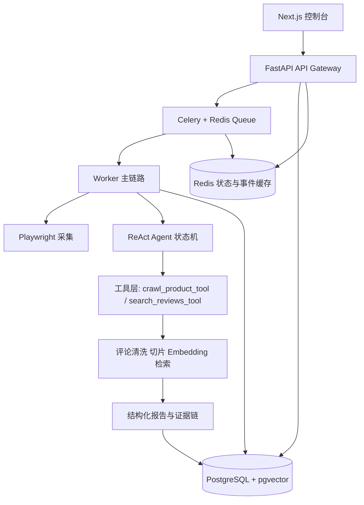

# MarketMind Agent

MarketMind Agent 是一个面向电商运营场景的评论洞察与证据链报告系统。

它不是普通爬虫脚本，也不是只会把评论丢给大模型总结的套壳 demo。项目重点解决三个问题：

- 评论分析是长任务，需要异步队列、状态持久化和失败恢复。
- 运营报告必须有证据链，不能只给一段看起来合理的 AI 文案。
- Agent 执行过程需要可追踪、可测试、可复盘，方便调试和面试展示。

截至 Day 30，仓库已经完成 Day 1-30 的第一阶段 release candidate：核心工程链路、自动化测试、CI、benchmark、失败任务 retry、演示材料、指标汇总、缺口复盘和 RC tag 均已收口。

## 架构图



## 当前能力

已完成：

- FastAPI 统一 API envelope、trace ID middleware 和错误封装。
- Celery + Redis 长任务分发，API 立即返回 `task_id`。
- Redis 状态快照、Redis 事件流、PostgreSQL 任务和事件持久化。
- Playwright 最小采集链路、HTML artifact 保存和采集失败分类。
- SQLAlchemy 数据模型：任务、事件、Agent runs/steps、商品、页面、评论、review chunks、报告、error logs。
- Agent 工具 schema、工具注册、工具执行 envelope 和最小 ReAct 状态机。
- Pydantic Guardrails、结构化输出修复和 self-heal 指标入口。
- 短期记忆滑动窗口、评论清洗切片、deterministic embedding 和 review chunk 检索原型。
- `search_reviews_tool`、结构化报告生成、证据链回查和风险机会评分。
- Next.js 控制台：任务提交、任务详情轮询、Agent step 摘要、历史任务、历史报告、报告详情和 evidence chain。
- 结构化错误日志、`error_logs` 持久化和观测错误查询 API。
- Docker Compose 拓扑、后端/前端 Dockerfile、迁移服务和 compose 契约测试。
- GitHub Actions CI、PR 模板、发布检查清单和回退运行手册。
- Day27 fixture benchmark：20 个样例任务，成功率 95.00%，平均 338 ms，P95 391 ms。
- Day28 失败任务 retry：`POST /api/tasks/{task_id}/retry`、`waiting_retry` 状态流和 Worker recovery resume 事件。
- Day34 可配置 embedding provider 架构：默认 fake provider 保证测试稳定，显式配置可接 OpenAI-compatible embedding，并包含缺 key、限流、超时和 bad response 错误分类。
- Day35 RAG 质量评估和 provider metrics baseline：5 个中文 query fixture、expected evidence 命中检查、空召回统计、fallback 和 provider 错误指标。

尚未完成：

- 全局 `GET /api/evidence`。
- 真实 embedding provider 付费调用、大规模人工标注召回质量评估和 pgvector 原生排序。
- 真实 LLM report prompt。
- 真实 `docker compose build` / `docker compose up` 联调。
- Playwright mock E2E 已接入；真实 Compose E2E 和 GitHub branch protection 待补。

## 快速启动

### 1. 后端本地开发

```powershell
uv sync
uv run alembic upgrade head
uv run uvicorn app.main:create_app --factory --app-dir backend --reload
```

默认 API：

```text
http://localhost:8000/api/health
```

### 2. 前端本地开发

```powershell
cd frontend
npm install
npm run dev
```

默认前端：

```text
http://localhost:3000
```

### 3. Docker Compose

当前已经验证 `docker compose config`，但还没有在本机完成真实镜像 build / compose up。Docker Desktop Linux engine 可用后再执行：

```powershell
Copy-Item .env.example .env
docker compose up --build
```

详细步骤见 [docker-compose-runbook.md](doc/supporting/docker-compose-runbook.md)。

## 常用验证

```powershell
uv run pytest
uv run pytest --cov=backend --cov-report=term-missing
uv run ruff check backend tests migrations
uv run alembic heads
docker compose config

cd frontend
npm run lint
npm run build
npm audit --audit-level=high
cd ..

uvx pip-audit
```

最新 Day35 本地完整门禁：

- `uv run pytest tests\test_rag_quality_metrics.py`：2 passed。
- Day35 RAG/provider 回归：16 passed。
- `uv run pytest`：200 passed。
- coverage：90.31%。
- ruff、alembic heads、compose config：通过。
- frontend lint / build / audit：通过。
- `uvx pip-audit`：No known vulnerabilities found。

## 演示路径

推荐按 5-8 分钟演示：

1. 打开 Next.js 控制台，说明系统定位是“评论洞察与证据链报告”。
2. 提交一个 fixture / public URL 任务，展示 API 返回 `task_id`。
3. 打开任务详情页，展示状态、事件流和 Agent step 摘要。
4. 打开历史任务和历史报告，说明任务不是一次性脚本，结果可复盘。
5. 打开报告详情和 evidence chain，说明报告结论如何回查到评论 chunk / artifact / Agent step。
6. 展示 Day27 benchmark artifact，说明性能指标不是口头估计。
7. 展示 Day28 retry API 和 recovery event，说明失败任务如何进入恢复链路。
8. 最后展示 GitHub Actions 通过记录和开发日志。

完整演示脚本见 [doc/supporting/demo-script.md](doc/supporting/demo-script.md)。

## 简历与面试材料

- 简历 bullet：见 [doc/supporting/resume-story.md](doc/supporting/resume-story.md)。
- 2 分钟项目讲述：见 [doc/supporting/interview-story.md](doc/supporting/interview-story.md)。
- 深度追问防守：见 [doc/supporting/interview-defense-dossier.md](doc/supporting/interview-defense-dossier.md)。
- 开发过程复盘：见 [doc/supporting/development-log.md](doc/supporting/development-log.md)。

## Day 30 Release Candidate

截至 Day 30，项目进入第一阶段 release candidate 收口。建议候选 tag 为 `v0.1-day30-rc1`，但它不是 v1.0。

Day30 相关材料：

- 发布候选边界：[doc/supporting/day30-release-candidate.md](doc/supporting/day30-release-candidate.md)
- 指标汇总：[doc/supporting/day30-metrics-summary.md](doc/supporting/day30-metrics-summary.md)
- 缺口与 bug 汇总：[doc/supporting/day30-bug-summary.md](doc/supporting/day30-bug-summary.md)

当前仍需如实说明：真实 `docker compose build/up`、真实 embedding provider 付费调用和真实线上召回质量评估尚未完成；真实 LLM report prompt 契约已完成但未调用付费 provider；Playwright 已完成 mock E2E，尚未完成真实 Compose E2E。

## 已知边界

这些边界需要在 README、面试和演示中如实说明：

- Day27 benchmark 是 fixture benchmark，不代表真实外部网站吞吐。
- 当前模型调用和 token 成本统计仍为 0，因为还没有跑真实 LLM / embedding provider 付费调用。
- Day28 retry 是任务级恢复，不是精确到 Agent Thought / Action / Observation 的完整 replay。
- `backoff_seconds` 当前只是 metadata，尚未接 Celery countdown。
- Docker Compose 目前只验证了配置解析，真实容器 build/up 需要 Docker Desktop daemon 可用后补验。
- 项目不承诺替代成熟卖家工具，也不承诺全网稳定采集或销量预测。

## 阅读顺序

1. [doc/README.md](doc/README.md)
2. [doc/supporting/project-charter.md](doc/supporting/project-charter.md)
3. [doc/supporting/architecture.md](doc/supporting/architecture.md)
4. [doc/supporting/api-contract.md](doc/supporting/api-contract.md)
5. [doc/supporting/testing-strategy.md](doc/supporting/testing-strategy.md)
6. [doc/supporting/demo-script.md](doc/supporting/demo-script.md)
7. [doc/supporting/resume-story.md](doc/supporting/resume-story.md)
8. [doc/supporting/interview-story.md](doc/supporting/interview-story.md)

## 分支策略

- `main`：稳定演示和可回退版本。
- `dev`：日常开发分支。
- commit 使用中文 Conventional Commit，例如 `feat: 增加 Day 28 失败重试和恢复策略`。
