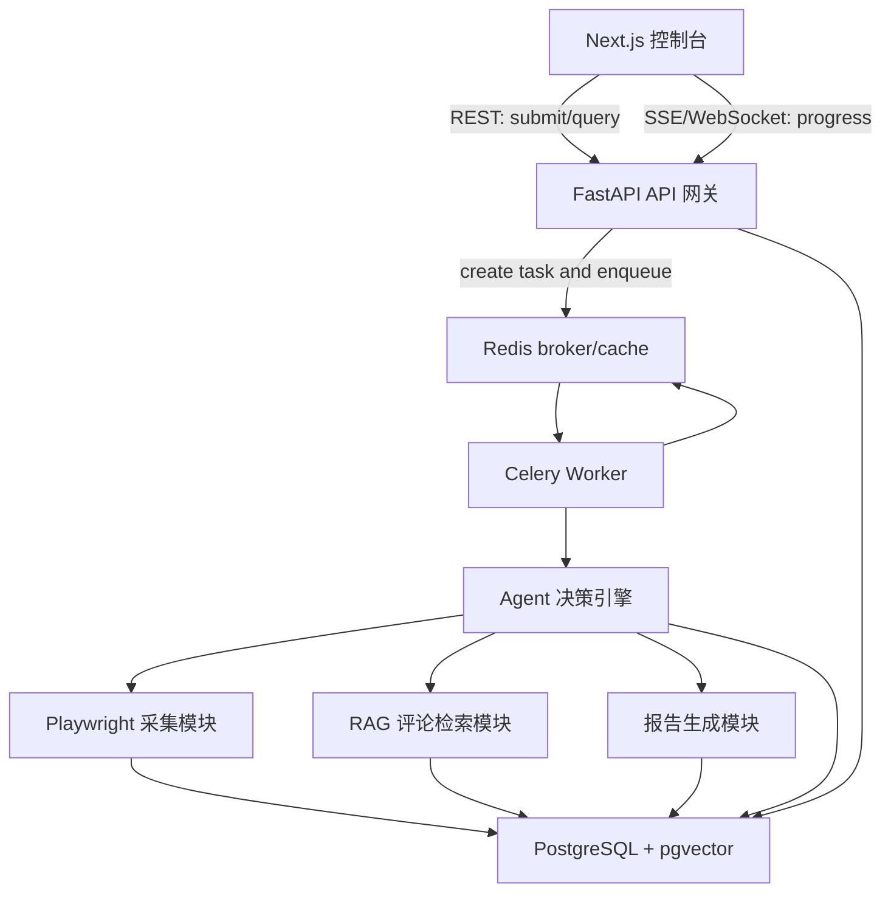

# 系统架构

## Day 2 冻结结论

第一版采用“模块化单体 + Celery worker + PostgreSQL/Redis 基础设施”的形态。这里的“模块化单体”指的是：代码在一个仓库和一个后端应用边界内维护，但按照 API、任务、Agent、采集、RAG、报告、存储、观测等业务边界拆包，禁止把所有逻辑堆进路由函数或单个脚本。

这个决策的目的不是弱化工程化，而是避免过早微服务化。30 天第一版最需要证明的是长任务解耦、状态可追踪、证据链报告和失败可恢复，而不是证明能维护一堆还没有真实流量压力的服务。

## 架构总图



## 运行时部署拓扑

第一版使用 Docker Compose 或本地多进程启动，服务边界如下：

| 运行单元 | 进程形态 | 主要职责 | 是否第一版必须 |
| --- | --- | --- | --- |
| `frontend` | Next.js dev/server | 控制台 UI、任务提交、报告查看、进度展示 | 是 |
| `api` | FastAPI + Uvicorn | 请求校验、统一响应、任务创建、任务查询、事件读取 | 是 |
| `worker` | Celery worker | 执行长任务、驱动 Agent、调用工具、写入状态 | 是 |
| `postgres` | PostgreSQL + pgvector | 业务数据、Agent 状态、报告、证据、向量索引 | 是 |
| `redis` | Redis | Celery broker、任务短期状态、临时上下文缓存 | 是 |
| `monitor` | Flower 或自定义页面 | 查看队列、任务失败、worker 状态 | 第二阶段 |

本地开发可以先不容器化 `frontend` 和 `api`，直接用 `npm run dev` 与 `uvicorn` 启动；数据库和 Redis 优先用 Docker Compose，减少 Windows 本机环境差异。

## 代码模块边界

后端第一版建议演进为以下目录。当前 `backend/app` 只完成了 `api` 与 `core` 的骨架，后续按这个边界逐步添加。

```text
backend/app/
  api/              # FastAPI router, request/response schema, endpoint layer
  core/             # settings, middleware, logging, trace id, shared errors
  storage/          # SQLAlchemy models, repositories, Alembic migrations
  tasks/            # Celery app, task definitions, retry policies
  agent/            # ReAct loop, tool registry, state recovery
  crawler/          # Playwright browser manager, adapters, extractors
  rag/              # cleaning, chunking, embedding, vector search
  reports/          # report schema, report composer, evidence citation
  observability/    # log events, metrics, audit helpers
```

前端第一版保持在 `frontend/src` 内分层：

```text
frontend/src/
  app/              # Next.js App Router pages
  components/       # reusable presentational components
  lib/api.ts        # backend client and mock switch
  lib/mock-data.ts  # local mock data for UI-only development
  lib/types.ts      # frontend-facing typed contracts
```

## 模块职责表

| 模块 | 允许做什么 | 禁止做什么 | 关键输出 |
| --- | --- | --- | --- |
| Frontend | 收集输入、展示进度、展示报告、触发重试 | 直接访问数据库、直接调用模型、直接跑爬虫 | 用户操作、页面状态 |
| API | 校验请求、创建任务、查询任务、统一错误响应 | 执行长任务、阻塞等待爬虫完成 | `task_id`、任务详情、事件流 |
| Celery | 调度长任务、重试、超时控制、失败归类 | 写业务判断结论、拼 UI 数据 | 任务执行结果、失败事件 |
| Agent | 规划步骤、选择工具、记录 Thought/Action/Observation | 绕过工具直接伪造证据、吞掉结构化错误 | `agent_steps`、工具调用链 |
| Crawler | 打开页面、抽取标题/价格/评论、保存原始证据 | 决定产品是否可做、生成最终报告 | 商品数据、评论、页面证据 |
| RAG | 清洗评论、切片、embedding、语义检索 | 把召回内容当成无条件事实 | 评论切片、相似证据 |
| Report | 汇总结论、引用证据、输出结构化报告 | 引用不存在的证据、隐藏低置信度 | 报告 JSON/Markdown |
| Storage | 持久化、事务、查询封装、迁移 | 在模型层写复杂业务流程 | 数据模型、repository |
| Observability | trace_id、日志、指标、错误分类 | 替代业务状态表 | 可排查日志和统计 |

## 主请求生命周期

1. 用户在 Next.js 控制台提交竞品 URL、品类关键词或兜底数据文件。
2. FastAPI 进行 Pydantic 校验，生成 `trace_id`，创建 `tasks` 记录。
3. API 将任务投递给 Celery，并立即返回统一 envelope：`task_id`、初始状态、`trace_id`。
4. 前端进入任务详情页，通过轮询或 SSE 读取 `task_events`。
5. Celery worker 加载任务上下文，创建 `agent_runs`。
6. Agent 进入 ReAct 循环，每次 Thought/Action 写入 `agent_steps`。
7. Agent 选择采集、清洗、检索、报告等工具，工具执行结果写回 Observation。
8. Crawler 把商品、评论、页面证据写入 PostgreSQL。
9. RAG 将评论清洗、切片、embedding，并存入 pgvector。
10. Report 模块基于结构化数据与检索证据生成报告。
11. Worker 更新任务为 `completed` 或 `failed`，API 向前端暴露最终报告入口。

## 状态与恢复原则

系统必须区分三种状态：

- 任务状态：面向用户，描述整体进度，例如 `queued`、`running`、`completed`、`failed`。
- Agent 步骤状态：面向调试和断点恢复，例如 `pending`、`running`、`success`、`failed`、`skipped`。
- 工具执行状态：面向局部失败处理，例如 Playwright 超时、embedding 失败、报告校验失败。

恢复策略：

- API 参数校验失败时不创建任务。
- 任务已入队但 worker 未消费时，任务停留在 `queued`。
- Agent 工具失败时，先记录 Observation，再由 Agent 判断重试、换工具或降级。
- LLM 输出不符合 Pydantic schema 时，记录失败输入和错误原因，再触发 self-correction。
- 报告证据不足时允许生成低置信度报告，但必须在报告中标注证据缺口。

## 失败隔离

| 故障层 | 典型症状 | 系统应如何处理 | 用户能看到什么 |
| --- | --- | --- | --- |
| API | 参数错误、URL 不合法 | 返回 4xx，任务不入队 | 表单错误和 trace_id |
| Redis/Celery | Worker 未启动、队列堵塞 | 任务保持 `queued`，记录队列等待 | 等待中和排队时间 |
| Crawler | 页面加载失败、DOM 变化 | 写入失败事件，允许重试或导入兜底 | 采集失败原因 |
| Agent | 输出格式错、工具选择错 | Pydantic 拦截，触发 self-heal | Agent 步骤失败/修复记录 |
| RAG | embedding 失败、召回为空 | 记录降级原因，报告标注证据不足 | 检索证据为空或不足 |
| Database | 写入失败、迁移缺失 | 任务失败并记录 trace_id | 任务失败和排查编号 |

## 为什么第一版不拆复杂微服务

- 当前阶段瓶颈不是服务数量，而是主链路能否稳定跑通。
- 过早拆服务会放大 Docker、网络、配置、日志和事务一致性的成本。
- Agent 状态机、RAG 和报告证据链需要频繁联调，单仓库更容易重构。
- Celery 已经提供了足够的异步边界，第一版不需要再引入 Kafka 或 Temporal。
- 面试展示时，清楚的模块边界和可解释的扩展路径比“服务数量多”更有说服力。

## 后续可拆分模块列表

只有当指标证明瓶颈存在时才拆服务：

| 可拆模块 | 触发条件 | 拆分方向 |
| --- | --- | --- |
| `crawler-worker` | Playwright 并发导致 worker 被浏览器资源占满 | 独立 worker 队列和浏览器池 |
| `rag-worker` | embedding 或向量写入耗时明显高于采集 | 独立队列和批处理 |
| `report-service` | 报告生成需要多模型、多模板、多版本管理 | 独立报告 API 或 worker |
| `scheduler` | 需要周期性复查评论变化和痛点趋势 | 定时任务服务 |
| `monitor` | 队列和失败任务需要可视化运营 | Flower 或自研任务监控页 |

## Day 2 后冻结的非目标

- 不引入 Kubernetes。
- 不引入 Kafka。
- 不在第一版使用 Milvus 或 Qdrant，除非 pgvector 明确不够用。
- 不做复杂用户权限系统。
- 不做绕过登录、验证码、付费墙或网站安全策略的采集。
- 不做多 Agent 自治协作，第一版坚持单 Agent + 工具调用。

## 与其他文档关系

- 表结构和状态字段见 `data-model.md`
- API 输入输出见 `api-contract.md`
- Agent 状态流见 `agent-state-machine.md`
- 部署细节见 `deployment.md`
- 未来拆分候选见 `future-iterations.md`
